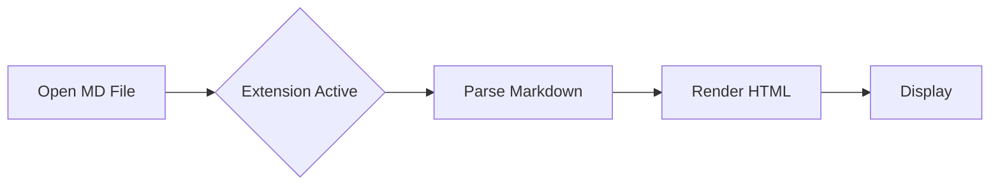

# Markdown Parser Browser Extension

> Automatically detect and render Markdown files in your browser with zero configuration.


## ✨ Features

- **Zero Configuration**: Install and forget - it just works
- **Automatic Detection**: Detects markdown files by URL extension (`.md`), content type, or content patterns
- **Beautiful Rendering**: Clean, readable styling with proper heading hierarchy
- **Mermaid Support**: Render flowcharts, sequence diagrams, class diagrams, and more
- **Local File Support**: Works with `file://` URLs for local markdown files
- **Non-Intrusive**: Only activates on markdown content, never affects other pages

## 📦 Installation

### Chrome / Edge / Brave (Developer Mode)

1. Download or clone this repository
2. Open your browser and navigate to the extensions page:
   - Chrome: `chrome://extensions/`
   - Edge: `edge://extensions/`
   - Brave: `brave://extensions/`
3. Enable **Developer mode** (toggle in the top right corner)
4. Click **Load unpacked**
5. Select the extension directory

### Enable Local File Access (Optional)

To render local markdown files (`file://` URLs):

1. Go to the extension details page
2. Enable **Allow access to file URLs**

## 🚀 Usage

Simply navigate to any markdown file in your browser:

- **Web URLs**: `https://example.com/readme.md`
- **GitHub Raw**: `https://raw.githubusercontent.com/user/repo/main/README.md`
- **Local Files**: `file:///path/to/your/document.md`

The extension automatically:
1. Detects if the content is Markdown
2. Parses the Markdown syntax
3. Renders it with beautiful formatting
4. Displays a small "MD" badge in the top right corner

## 🎨 Supported Markdown Features

### Standard Syntax
- Headings (H1-H6)
- Bold, italic, strikethrough text
- Ordered and unordered lists
- Task lists (checkboxes)
- Code blocks with language hints
- Inline code
- Blockquotes
- Links and images
- Tables
- Horizontal rules

### Extended Features
- GFM (GitHub Flavored Markdown) tables
- Automatic URL linking
- Relative path resolution for images and links

### Mermaid Diagrams
Supports all major Mermaid diagram types:
- Flowcharts
- Sequence diagrams
- Class diagrams
- State diagrams
- Entity Relationship diagrams
- And more...



## 🔒 Permissions

This extension requires minimal permissions:

| Permission | Purpose |
|------------|---------|
| `activeTab` | Access current tab content when activated |
| `scripting` | Inject rendering scripts |
| `file://*/*` | Read local markdown files (user must enable) |

## 🛠️ Technical Details

### Architecture
- **Manifest Version**: V3 (latest Chrome extension standard)
- **Content Script**: Handles detection and rendering
- **External Libraries**:
  - [marked.js](https://marked.js.org/) - Markdown parser
  - [Mermaid.js](https://mermaid.js.org/) - Diagram renderer

### Performance
- Fast detection (<50ms)
- Lazy loading of Mermaid (only when diagrams detected)
- Large file protection (>1MB files skipped)

## 📁 Project Structure

```
browser-extension-mdparser/
├── manifest.json      # Extension configuration
├── content.js         # Main content script
├── styles.css         # Rendering styles
├── icons/             # Extension icons
│   ├── icon16.png
│   ├── icon32.png
│   ├── icon48.png
│   └── icon128.png
├── test/              # Test files
│   └── sample.md
├── PRD-en.md          # Product requirements
└── README.md          # This file
```

## 🔧 Development

### Setup

```bash
# Clone the repository
git clone https://github.com/tanghoong/browser-extension-mdparser.git

# Navigate to the directory
cd browser-extension-mdparser
```

### Testing

1. Load the extension in developer mode
2. Open `test/sample.md` to verify rendering
3. Test with various markdown files from different sources

### Building for Production

This extension doesn't require a build step. Simply package the following files:
- `manifest.json`
- `content.js`
- `styles.css`
- `icons/` directory

## 🗺️ Roadmap

### v1.0 (Current)
- [x] Automatic markdown detection
- [x] Basic markdown rendering
- [x] Mermaid diagram support
- [x] Local file support

### v1.1 (Planned)
- [ ] Dark/Light theme toggle
- [ ] Font size adjustment
- [ ] Table of Contents generation
- [ ] Export Mermaid diagrams as images
- [ ] Per-site enable/disable settings

## 🤝 Contributing

Contributions are welcome! Please feel free to submit a Pull Request.

## 📄 License

This project is open source and available under the [MIT License](LICENSE).

## 🙏 Acknowledgments

- [marked.js](https://marked.js.org/) - A markdown parser and compiler
- [Mermaid.js](https://mermaid.js.org/) - Generate diagrams from text

---

**Markdown Parser** - *Read Markdown, Instantly.*
