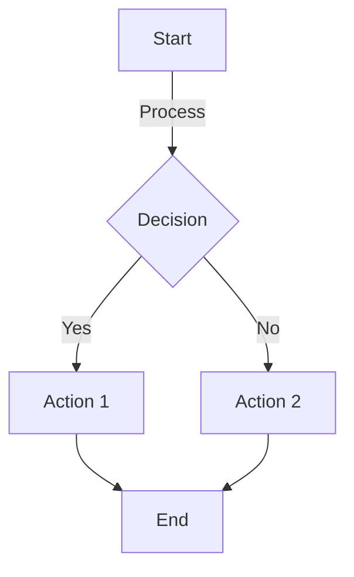

# Additional Features Demo

This demo showcases the newly implemented features based on FEEDBACK-1.md improvements.

## 1. Slack Chat Block

Test Slack-style chat messages:

```slack
[Alice|9:45 AM] Hey team! *Great work* on the new feature. 🎉
[Bob|9:46 AM] Thanks @Alice! The `authentication module` is now complete.
[Charlie|9:47 AM] Awesome! Can you share the link? [Documentation](https://example.com/docs)
[Alice|9:48 AM] Don't forget to test on #staging-server before production.
```

## 2. Discord Chat Block

Test Discord-style chat messages:

```discord
[DevMaster|10:30 AM] @everyone The new build is ready for testing!
[CoolCoder|10:31 AM] Nice! I'll check the `API endpoints` right away.
[DesignGuru|10:32 AM] The UI looks _amazing_ with the new gradient theme 🎨
[DevMaster|10:33 AM] Head over to #general for the release notes.
[BugHunter|10:35 AM] Found a small issue but already *fixed* it! PR: [#142](https://github.com/example/pull/142)
```

## 3. Enhanced Audio Player

Test the beautiful new audio player styling:

[Sample Audio Track](https://www.soundhelix.com/examples/mp3/SoundHelix-Song-1.mp3)

The audio player now features:
- Gradient purple background
- Glassmorphism effects
- Play icon overlay
- Modern controls styling

## 4. YouTube Offline Placeholder

Test YouTube placeholder with play button overlay:

[Amazing Video Tutorial](https://www.youtube.com/watch?v=dQw4w9WgXcQ)

Features:
- High-quality thumbnail from YouTube
- Large red play button overlay with hover animation
- Title overlay at the bottom
- Click to open on YouTube

## 5. Enhanced Presentation Mode

The presentation mode now features:
- **Gradient background** instead of flat black
- **Glassmorphism toolbar** with blur effects
- **Slide animations** with smooth transitions
- **Better shadows** and border highlights
- **Improved toolbar buttons** with hover effects

Try entering presentation mode (if slides are detected) to see the improvements!

## 6. Fixed Canvas Security Error

The "Download as PNG" button for Mermaid diagrams now:
- **Removes external image references** to prevent CORS issues
- **Inlines all styles** to avoid external CSS
- **Graceful fallback** to SVG download if canvas is tainted
- **Better error handling** with user feedback

Test with a Mermaid diagram:



## Summary of Improvements

✅ **Slack chatblock styling** - Professional Slack-like chat UI  
✅ **Discord chatblock styling** - Dark Discord-themed chat UI  
✅ **Audio player enhancement** - Gradient background with modern controls  
✅ **YouTube offline placeholder** - Thumbnail + play overlay instead of broken iframe  
✅ **Presentation mode polish** - Glassmorphism, animations, gradients  
✅ **Canvas security fix** - Handles CORS errors with fallback to SVG download  

---

### Testing Instructions

1. **Chat Blocks**: Both Slack and Discord chat blocks should render with:
   - Avatar circles (Slack) or rounded (Discord)
   - Proper color schemes
   - Support for `code`, *bold*, _italic_, @mentions, #channels, [links](url)
   
2. **Audio Player**: Click the audio link to see the gradient player with play icon

3. **YouTube**: Click the thumbnail to open video on YouTube (works offline!)

4. **Presentation Mode**: Look for the presentation button if slides detected

5. **Mermaid PNG**: Click "Download PNG" on the diagram above - should work without errors!
