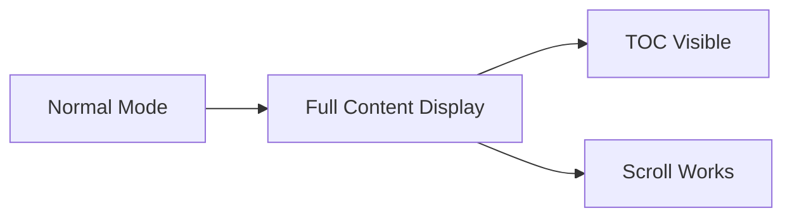

# Content Display Test

## Testing Normal Markdown Display

This document tests that **normal markdown content displays correctly** when there are NO slide separators.

### Features That Should Work:

1. **Headings** - All levels should display
2. **Text formatting** - *italic*, **bold**, `code`
3. **Lists** - Ordered and unordered
4. **Links** - [Example Link](https://example.com)
5. **Images** - If you have local images
6. **Code blocks** - With syntax highlighting

```javascript
function normalContentTest() {
  console.log("This should display in normal mode!");
  return "No presentation button should appear";
}
```

### Mermaid Diagrams



### Expected Behavior:

- ✅ Content displays as normal scrollable page
- ✅ Table of Contents appears in sidebar
- ✅ No "Presentation Mode" button appears
- ✅ All content visible at once
- ✅ Normal scrolling works

---

**Note:** This document should display in **NORMAL mode** because there are no slide separators (horizontal rules as content dividers).
