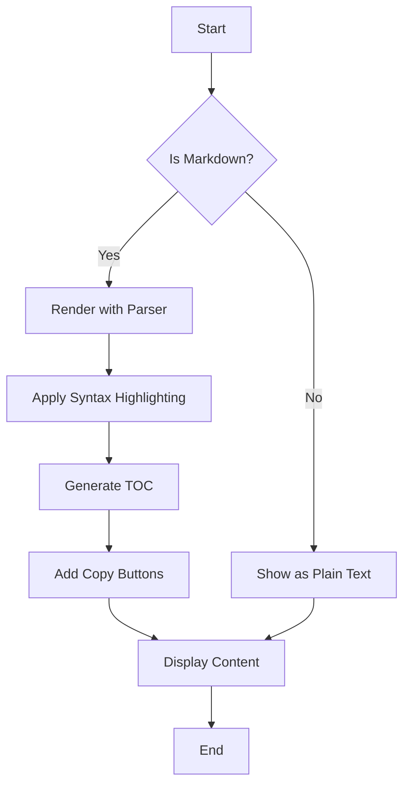
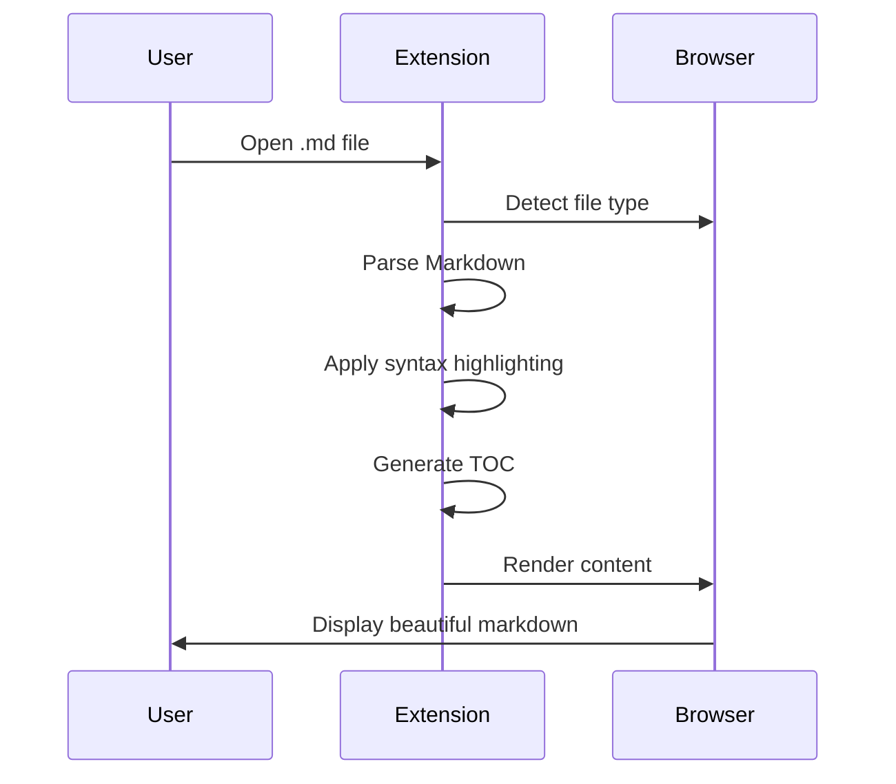
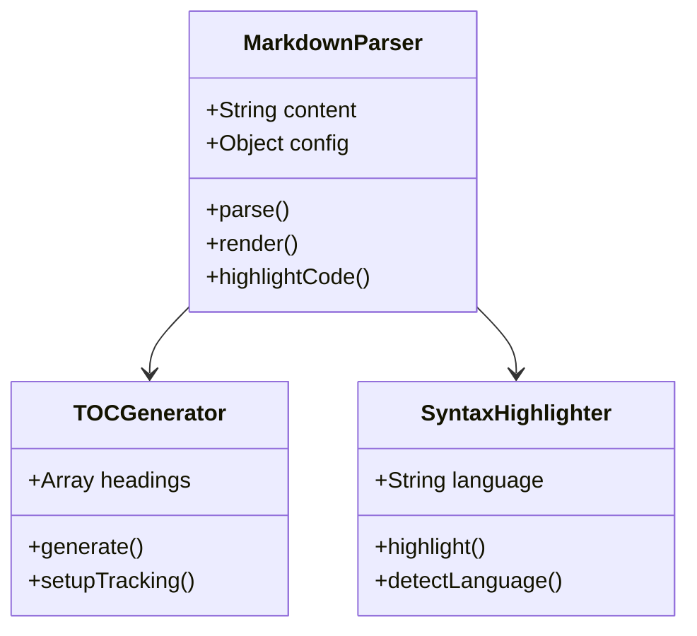

# Phase 2 Features Demo

Welcome to the Phase 2 features demonstration! This document showcases all the new enhanced user experience features.

## 📑 Table of Contents

Notice the **Table of Contents** sidebar on the left! It auto-generates from all headings in this document. Click any item to jump to that section. The active heading is highlighted as you scroll.

### TOC Features:
- Auto-generated from all headings
- Click to navigate with smooth scrolling
- Active item tracking as you scroll
- Collapsible with toggle button (◀)
- Hierarchical indentation by heading level

---

## 🎨 Syntax Highlighting

All code blocks now have beautiful syntax highlighting with language-specific color coding!

### JavaScript Example

```javascript
// JavaScript with syntax highlighting
class MarkdownParser {
  constructor(options) {
    this.options = options;
    this.plugins = [];
  }

  parse(markdown) {
    const tokens = this.tokenize(markdown);
    return this.render(tokens);
  }

  addPlugin(plugin) {
    this.plugins.push(plugin);
  }
}

const parser = new MarkdownParser({ gfm: true });
console.log('Parser initialized!');
```

Notice the **language badge** in the top-left corner and the **copy button** on hover!

### Python Example

```python
# Python with beautiful syntax highlighting
def fibonacci(n):
    """Generate Fibonacci sequence up to n"""
    a, b = 0, 1
    result = []
    
    while a < n:
        result.append(a)
        a, b = b, a + b
    
    return result

# Generate first 10 Fibonacci numbers
fib_numbers = fibonacci(100)
print(f"Fibonacci sequence: {fib_numbers}")
```

### HTML & CSS

```html
<!DOCTYPE html>
<html lang="en">
<head>
    <meta charset="UTF-8">
    <meta name="viewport" content="width=device-width, initial-scale=1.0">
    <title>Syntax Highlighting Demo</title>
    <style>
        body {
            font-family: 'Segoe UI', sans-serif;
            max-width: 800px;
            margin: 0 auto;
            padding: 20px;
        }
        .highlight { background: #ffeb3b; }
    </style>
</head>
<body>
    <h1>Welcome!</h1>
    <p class="highlight">Syntax highlighting makes code beautiful!</p>
</body>
</html>
```

### JSON

```json
{
  "extension": "markdown-parser",
  "version": "1.1.0",
  "features": {
    "phase1": [
      "Toggle view",
      "Copy code blocks",
      "Scroll to top",
      "TXT support"
    ],
    "phase2": [
      "Syntax highlighting",
      "Table of contents",
      "Link confirmation",
      "Mermaid enhancements"
    ]
  },
  "dependencies": {
    "marked": "9.1.6",
    "mermaid": "10.6.1",
    "highlight.js": "11.9.0"
  }
}
```

### SQL

```sql
-- SQL syntax highlighting
SELECT 
    u.username,
    u.email,
    COUNT(p.id) as post_count
FROM users u
LEFT JOIN posts p ON u.id = p.user_id
WHERE u.active = TRUE
GROUP BY u.id, u.username, u.email
HAVING COUNT(p.id) > 5
ORDER BY post_count DESC
LIMIT 10;
```

---

## 🔗 Link Confirmation Modal

Try clicking this external link: [GitHub](https://github.com)

You'll see a modal asking you to confirm before opening the link in a new tab!

**Features:**
- Shows the full URL for verification
- "Open in New Tab" or "Cancel" options
- Click outside modal to close
- Press ESC to cancel
- Internal anchor links (like TOC) work normally

Try these links:
- [Google](https://google.com)
- [Wikipedia](https://wikipedia.org)
- [MDN Web Docs](https://developer.mozilla.org)

---

## 📊 Mermaid Enhancements

Mermaid diagrams now have a **Copy Code** button! Hover over the diagram to see it.

### Flowchart Example



**Try this:** Hover over the diagram above and click "Copy Code" to get the Mermaid source code!

### Sequence Diagram



### Class Diagram



---

## 📝 More Headings for TOC Demo

Let's add more sections to demonstrate the Table of Contents functionality!

### Section Alpha

Lorem ipsum dolor sit amet, consectetur adipiscing elit. Sed do eiusmod tempor incididunt ut labore et dolore magna aliqua.

#### Subsection Alpha-1

Ut enim ad minim veniam, quis nostrud exercitation ullamco laboris nisi ut aliquip ex ea commodo consequat.

#### Subsection Alpha-2

Duis aute irure dolor in reprehenderit in voluptate velit esse cillum dolore eu fugiat nulla pariatur.

### Section Beta

Excepteur sint occaecat cupidatat non proident, sunt in culpa qui officia deserunt mollit anim id est laborum.

#### Subsection Beta-1

Sed ut perspiciatis unde omnis iste natus error sit voluptatem accusantium doloremque laudantium.

##### Deep Subsection Beta-1-A

Totam rem aperiam, eaque ipsa quae ab illo inventore veritatis et quasi architecto beatae vitae dicta sunt explicabo.

##### Deep Subsection Beta-1-B

Nemo enim ipsam voluptatem quia voluptas sit aspernatur aut odit aut fugit.

#### Subsection Beta-2

Neque porro quisquam est, qui dolorem ipsum quia dolor sit amet, consectetur, adipisci velit.

### Section Gamma

Sed quia non numquam eius modi tempora incidunt ut labore et dolore magnam aliquam quaerat voluptatem.

---

## 🔄 More Code Examples

### Bash/Shell

```bash
#!/bin/bash
# Deployment script with syntax highlighting

echo "Starting deployment..."

# Build the project
npm run build

# Run tests
npm test

# Deploy to production
if [ $? -eq 0 ]; then
    echo "✅ Tests passed! Deploying..."
    rsync -avz dist/ user@server:/var/www/
    echo "✅ Deployment complete!"
else
    echo "❌ Tests failed! Deployment aborted."
    exit 1
fi
```

### Ruby

```ruby
# Ruby syntax highlighting
class Person
  attr_accessor :name, :age
  
  def initialize(name, age)
    @name = name
    @age = age
  end
  
  def greet
    puts "Hello, my name is #{@name} and I'm #{@age} years old."
  end
  
  def self.create_group(people)
    people.map { |p| new(p[:name], p[:age]) }
  end
end

person = Person.new("Alice", 30)
person.greet
```

### TypeScript

```typescript
// TypeScript with type annotations
interface User {
  id: number;
  username: string;
  email: string;
  roles: string[];
}

class UserService {
  private users: Map<number, User>;
  
  constructor() {
    this.users = new Map();
  }
  
  async createUser(data: Omit<User, 'id'>): Promise<User> {
    const id = this.users.size + 1;
    const user: User = { id, ...data };
    this.users.set(id, user);
    return user;
  }
  
  getUser(id: number): User | undefined {
    return this.users.get(id);
  }
}

const service = new UserService();
```

---

## 🎯 Feature Summary

### Phase 2 Completed Features:

✅ **Syntax Highlighting**
- 190+ languages supported
- Language badge on each block
- GitHub-style theme
- Auto-language detection

✅ **Table of Contents**
- Auto-generated from headings
- Smooth scroll navigation
- Active heading tracking
- Collapsible sidebar
- Hierarchical indentation

✅ **Link Confirmation Modal**
- Confirms external links
- Shows full URL
- ESC and click-outside to close
- Safe browsing experience

✅ **Mermaid Enhancements**
- Copy Code button
- Stores original source
- Easy diagram sharing

---

## 🧪 Testing Checklist

Try these actions to test all features:

- [ ] Check Table of Contents on the left
- [ ] Click TOC items to navigate
- [ ] Scroll and watch active item update
- [ ] Toggle TOC with ◀ button
- [ ] Hover over code blocks to see copy buttons
- [ ] Click copy button and paste code
- [ ] Verify syntax highlighting colors
- [ ] Check language badges on code blocks
- [ ] Click an external link
- [ ] See the confirmation modal
- [ ] Try "Open in New Tab" and "Cancel"
- [ ] Press ESC to close modal
- [ ] Hover over Mermaid diagrams
- [ ] Click "Copy Code" button on Mermaid
- [ ] Paste and verify Mermaid source code

---

## 🎉 End of Demo

All Phase 2 features are now implemented and working! The extension provides a much richer experience with syntax highlighting, intelligent navigation, and safety features.

**Next up:** Phase 3 - Multimedia features! 🎥🎵
