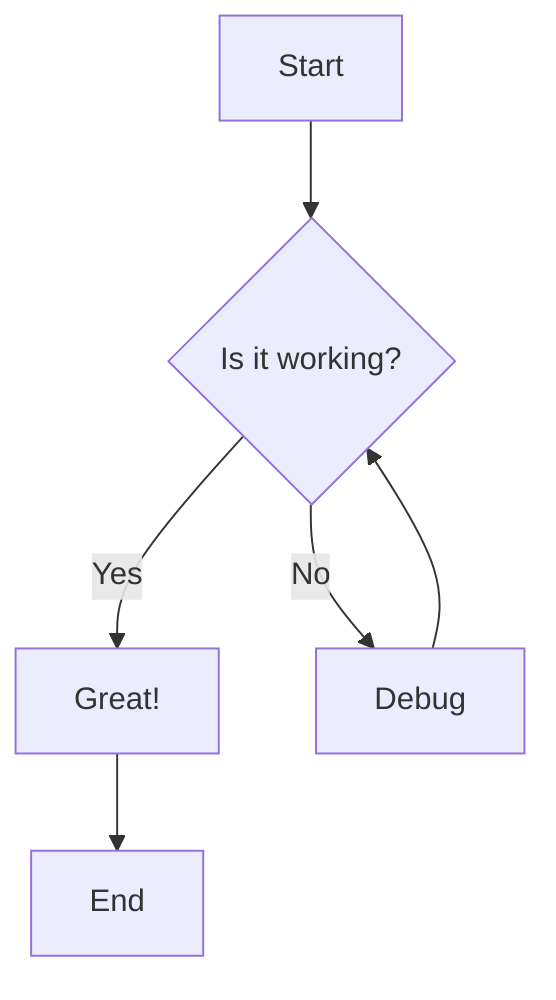
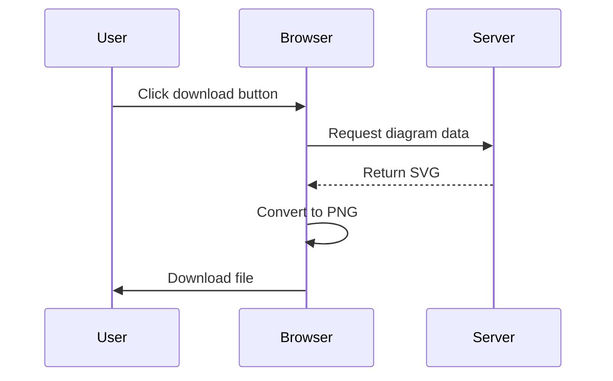
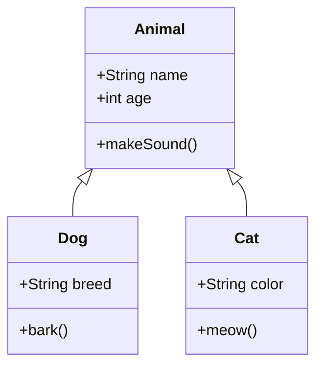
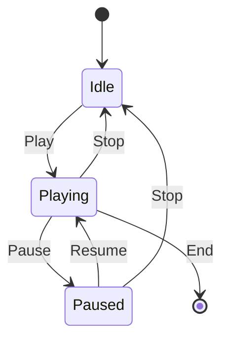
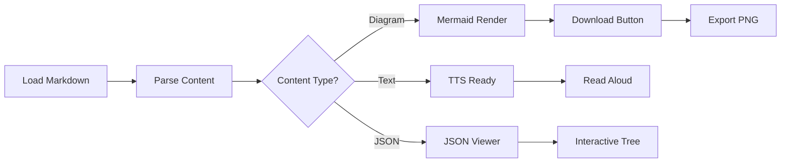

# Phase 4 Demo: Interactive Features

This document demonstrates all Phase 4 features: Text-to-Speech, JSON Viewer, and Mermaid download capabilities.

---

## 1. Text-to-Speech (TTS)

The TTS toolbar appears in the top-right corner of the page. It allows you to:

- **Play/Pause** - Start or pause reading the document
- **Stop** - Stop reading and reset to the beginning
- **Speed Control** - Adjust reading speed from 0.5x to 2.0x
- **Voice Selection** - Choose from available system voices

### How It Works

When you click play, the extension will:
1. Read each paragraph, heading, and list item sequentially
2. Highlight the current paragraph being read (yellow background)
3. Auto-scroll to keep the reading position visible
4. Continue until the end of the document or stopped

### Example Content for TTS

The quick brown fox jumps over the lazy dog. This pangram contains every letter of the English alphabet at least once.

Text-to-Speech technology converts written text into spoken words using speech synthesis. Modern TTS systems use advanced machine learning models to produce natural-sounding speech.

This feature is perfect for:
- Accessibility and screen reading
- Multitasking while consuming content
- Learning and pronunciation practice
- Long document review

---

## 2. JSON Tree Viewer

The extension automatically renders JSON code blocks as interactive tree viewers.

### Simple JSON Example

```json
{
  "name": "John Doe",
  "age": 30,
  "email": "john.doe@example.com",
  "active": true
}
```

### Complex Nested JSON

```json
{
  "user": {
    "id": 12345,
    "username": "johndoe",
    "profile": {
      "firstName": "John",
      "lastName": "Doe",
      "avatar": "https://example.com/avatar.jpg",
      "bio": "Software developer and tech enthusiast"
    },
    "settings": {
      "theme": "dark",
      "notifications": {
        "email": true,
        "push": false,
        "sms": true
      },
      "privacy": {
        "showEmail": false,
        "showPhone": false,
        "allowMessagesFrom": "friends"
      }
    }
  },
  "posts": [
    {
      "id": 1,
      "title": "Getting Started with Markdown",
      "content": "Markdown is a lightweight markup language...",
      "tags": ["markdown", "tutorial", "writing"],
      "published": true,
      "likes": 42
    },
    {
      "id": 2,
      "title": "Introduction to JSON",
      "content": "JSON (JavaScript Object Notation) is...",
      "tags": ["json", "data", "tutorial"],
      "published": true,
      "likes": 38
    }
  ],
  "followers": [101, 102, 103, 104, 105],
  "following": [201, 202, 203]
}
```

### API Response Example

```json
{
  "status": "success",
  "code": 200,
  "data": {
    "products": [
      {
        "id": "prod_001",
        "name": "Wireless Mouse",
        "price": 29.99,
        "currency": "USD",
        "stock": 150,
        "categories": ["electronics", "accessories"],
        "specifications": {
          "color": "black",
          "connectivity": "Bluetooth 5.0",
          "battery": "2x AA",
          "warranty": "1 year"
        }
      },
      {
        "id": "prod_002",
        "name": "Mechanical Keyboard",
        "price": 89.99,
        "currency": "USD",
        "stock": 75,
        "categories": ["electronics", "peripherals"],
        "specifications": {
          "color": "RGB",
          "switchType": "Cherry MX Blue",
          "layout": "Full-size",
          "warranty": "2 years"
        }
      }
    ],
    "total": 2,
    "page": 1,
    "perPage": 10
  },
  "timestamp": "2025-01-31T12:00:00Z"
}
```

### JSON Viewer Features

✅ **Interactive Tree**
- Click arrows to expand/collapse nodes
- Color-coded values by type (string, number, boolean, null)
- Preview for objects and arrays showing count

✅ **Toolbar Actions**
- **Expand All** - Open all nested nodes
- **Collapse All** - Close all nested nodes
- **Copy JSON** - Copy entire JSON to clipboard

✅ **Path Copying**
- Hover over any line to see copy button
- Click to copy the JSON path (e.g., `user.profile.firstName`)
- Useful for accessing nested values in code

---

## 3. Mermaid Diagram Download

All Mermaid diagrams now have a "Download PNG" button in the top-right corner.

### Simple Flowchart



### Sequence Diagram



### Class Diagram



### State Diagram



### Download Features

- **One-click download** - Click button to save diagram
- **PNG format** - Compatible with all applications
- **White background** - Clean, printable images
- **Full resolution** - No quality loss

---

## 4. Combined Example: Product Documentation

Let's combine multiple Phase 4 features in a realistic documentation scenario.

### Product Configuration

This JSON represents our product settings:

```json
{
  "product": {
    "name": "Markdown Parser Extension",
    "version": "1.0.0",
    "features": {
      "rendering": {
        "mermaid": true,
        "syntaxHighlighting": true,
        "tableOfContents": true
      },
      "multimedia": {
        "youtube": true,
        "audio": true,
        "chatBlocks": true
      },
      "interactive": {
        "tts": true,
        "jsonViewer": true,
        "mermaidDownload": true
      }
    },
    "browser": "Chrome",
    "manifestVersion": 3
  }
}
```

### Feature Flow

Here's how features work together:



---

## Features Summary

### ✅ Text-to-Speech
- Fixed toolbar in top-right corner
- Play/pause/stop controls
- Speed adjustment (0.5x - 2.0x)
- Voice selection
- Paragraph highlighting
- Auto-scroll tracking
- Works with all text content

### ✅ JSON Tree Viewer
- Replaces JSON code blocks with interactive tree
- Expand/collapse nodes
- Type-based color coding
- Copy JSON paths
- Toolbar with expand/collapse all
- Copy entire JSON
- Clean, readable layout

### ✅ Mermaid Download
- Download button on each diagram
- PNG export format
- High-quality output
- White background for printing
- Filename includes timestamp

---

## Usage Tips

### TTS Best Practices
1. Use headings to organize content for better TTS flow
2. Shorter paragraphs work better with highlighting
3. Adjust speed based on content complexity
4. Try different voices to find the clearest option

### JSON Viewer Tips
1. Use the collapse/expand all buttons for overview
2. Copy paths when referencing data in code
3. Check value types with color coding
4. Nest related data for better organization

### Mermaid Export Tips
1. Download before making changes to source
2. Use clear labels for better exported images
3. Test diagram complexity - simpler is clearer
4. Downloaded PNGs work great in presentations

---

## Accessibility Features

All Phase 4 features enhance accessibility:

- **TTS** - Screen reading for visually impaired users
- **JSON Viewer** - Clearer data structure visualization
- **Mermaid Export** - Share diagrams in accessible formats
- **Keyboard Navigation** - All controls accessible via keyboard

---

## Performance Notes

- TTS uses browser's native speech synthesis (no downloads)
- JSON viewer renders instantly (no external libraries)
- Mermaid download uses Canvas API (client-side only)
- All features work offline once extension is loaded
