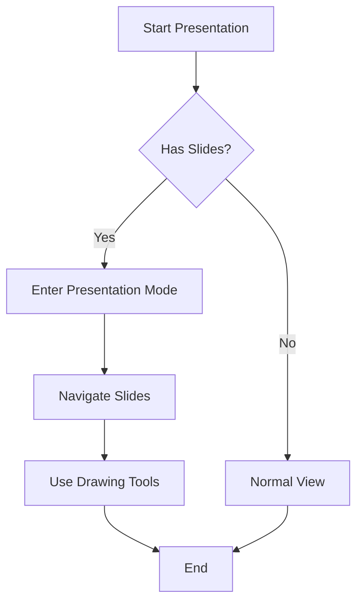

# 📊 Presentation Mode Demo

Welcome to the **Presentation Mode** feature demonstration!

Click the **📊 Presentation Mode** button in the bottom-right corner to enter full-screen presentation.

---

# 🎯 Slide 1: Introduction

## What is Presentation Mode?

Presentation Mode transforms your markdown documents into **interactive slideshows**.

**Key Features:**
- 📺 Full-screen slide display
- ⌨️ Keyboard navigation
- 🖱️ Mouse click navigation
- ✏️ Drawing tools
- 🔴 Laser pointer
- 📍 Slide counter

---

# 🚀 Slide 2: Navigation

## How to Navigate

### Keyboard Controls
- **→ / Space / PageDown** - Next slide
- **← / PageUp** - Previous slide
- **Home** - First slide
- **End** - Last slide
- **ESC** - Exit presentation

### Mouse Controls
- **Click Right Half** - Next slide
- **Click Left Half** - Previous slide

---

# ✏️ Slide 3: Drawing Tools

## Interactive Annotation

Use the toolbar at the top-right:

1. **✏️ Pen Tool** - Draw with red pen
2. **🖍️ Highlighter** - Highlight with yellow marker
3. **🔴 Laser Pointer** - Animated red laser pointer
4. **🗑️ Clear** - Erase all drawings
5. **❌ Exit** - Return to normal view

---

# 💡 Slide 4: Code Examples

## Syntax Highlighting in Slides

```javascript
// Presentation Manager
function enterPresentationMode() {
  console.log('Starting presentation...');
  showSlide(0);
}

// Navigate between slides
function nextSlide() {
  if (currentSlide < slides.length - 1) {
    showSlide(currentSlide + 1);
  }
}
```

Code blocks maintain full syntax highlighting!

---

# 📊 Slide 5: Diagrams with Mermaid

## Flowchart Example



Mermaid diagrams render perfectly in slides!

---

# 🎨 Slide 6: Rich Content

## Images and Media


> **Pro Tip:** All multimedia elements work in presentation mode, including images, videos, and audio players!

---

# 📋 Slide 7: Lists and Tables

## Feature Comparison

| Feature | Normal View | Presentation Mode |
|---------|-------------|-------------------|
| Navigation | Scroll | Slide-by-slide |
| Annotations | ❌ No | ✅ Yes |
| Full Screen | ❌ No | ✅ Yes |
| Laser Pointer | ❌ No | ✅ Yes |

### Additional Features:
- Automatic slide detection
- Smooth transitions
- Responsive design
- Print-friendly output

---

# 🎭 Slide 8: Custom Styling

## Beautiful Typography

The presentation mode enhances text with:

- **Larger headings** (3em for H1)
- **Better line spacing** (1.8 for paragraphs)
- **Enhanced contrast** for readability
- **Rounded corners** and shadows
- **Auto-centered images**

### Quote Example

> "Presentation mode makes your markdown documents shine on the big screen!" 
> — Markdown Parser Extension

---

# 🔢 Slide 9: Mathematical Expressions

## KaTeX Support

You can include mathematical formulas:

**Inline math:** The equation $E = mc^2$ shows mass-energy equivalence.

**Block math:**

$$
\int_{-\infty}^{\infty} e^{-x^2} dx = \sqrt{\pi}
$$

$$
f(x) = \frac{1}{\sigma\sqrt{2\pi}} e^{-\frac{1}{2}\left(\frac{x-\mu}{\sigma}\right)^2}
$$

---

# 🎯 Slide 10: Practical Uses

## When to Use Presentation Mode

### Perfect for:
1. **Technical presentations** with code examples
2. **Documentation walkthroughs** with diagrams
3. **Educational content** with step-by-step instructions
4. **Meeting notes** that need visual presentation
5. **Product demos** with screenshots
6. **Training materials** with interactive elements

### How to Create Slides:
Simply separate your content with `---` or `***` horizontal rules!

---

# 🌟 Slide 11: Advanced Features

## Drawing and Annotations

Try these interactive features:

1. **Pen Tool** (✏️)
   - Draw arrows and underlines
   - Perfect for emphasizing points
   - Red color for visibility

2. **Highlighter** (🖍️)
   - Semi-transparent yellow
   - Great for marking text
   - Wider stroke than pen

3. **Laser Pointer** (🔴)
   - Animated pulsing effect
   - Follows mouse movement
   - No permanent marks

---

# 📱 Slide 12: Responsive Design

## Works on Any Screen

Presentation mode adapts to:

- 💻 **Desktop monitors** - Large display
- 📱 **Tablets** - Medium screens
- 📲 **Mobile devices** - Small screens

The layout automatically adjusts:
- Font sizes scale down on mobile
- Toolbar buttons become smaller
- Slides remain readable
- Touch navigation supported

---

# 🎨 Slide 13: ChatBlock Themes

You can use custom ChatBlock syntax in slides:

```chatblock:user
Can I use ChatBlocks in presentation mode?
```

```chatblock:assistant
Absolutely! All ChatBlock themes work perfectly:
- User messages (blue)
- Assistant messages (green)
- System messages (yellow)
- Error messages (red)
- Warning messages (orange)
```

```chatblock:system
System: Presentation mode initialized successfully!
```

---

# 🔊 Slide 14: Multimedia Integration

## Audio and Video Support

### Embed YouTube Videos:
```
https://www.youtube.com/watch?v=dQw4w9WgXcQ
```

### Audio Files:
```

```

**Note:** Media playback automatically stops when changing slides!

---

# 📸 Slide 15: Screenshots and Images

## Enhanced Image Rendering

Images in presentation mode get:

- **Auto-centering** for better layout
- **Border radius** for modern look
- **Box shadows** for depth
- **Responsive sizing** to fit slides
- **Zoom on hover** (optional)

Perfect for:
- Product screenshots
- Architecture diagrams
- Photo galleries
- Infographics

---

# 🎓 Slide 16: Educational Content

## Learning with Presentations

### Step-by-Step Tutorials:

**Step 1:** Create your markdown file
```markdown
# My Presentation
Content here...
---
# Next Slide
More content...
```

**Step 2:** Add horizontal rules (`---`) between slides

**Step 3:** Click the Presentation Mode button

**Step 4:** Navigate with keyboard or mouse

---

# 🔍 Slide 17: Details and Organization

## Structured Content

### Category 1: Features
- ✅ Auto slide detection
- ✅ Keyboard navigation
- ✅ Drawing tools
- ✅ Laser pointer

### Category 2: Compatibility
- ✅ All markdown syntax
- ✅ Code highlighting
- ✅ Mermaid diagrams
- ✅ Tables and lists

### Category 3: Usability
- ✅ Intuitive controls
- ✅ Visual feedback
- ✅ Print support
- ✅ Responsive design

---

# 🎯 Slide 18: Best Practices

## Tips for Great Presentations

1. **Keep slides focused**
   - One main idea per slide
   - Use bullet points sparingly
   - Include visuals

2. **Use consistent formatting**
   - Maintain heading hierarchy
   - Consistent code block styling
   - Uniform image sizes

3. **Leverage interactivity**
   - Use drawing tools to emphasize
   - Laser pointer for demonstrations
   - Navigate smoothly

---

# 🚀 Slide 19: Performance

## Optimized for Speed

Presentation mode is built for performance:

- **Fast rendering** with efficient DOM updates
- **Smooth animations** using CSS transforms
- **Memory efficient** with single active slide
- **No external dependencies** for core features
- **Instant navigation** between slides

### Technical Highlights:
- Canvas-based drawing
- CSS hardware acceleration
- Event delegation for controls
- Lazy media loading

---

# 🎉 Slide 20: Thank You!

## Start Creating Presentations!

### Quick Start:
1. Write your markdown
2. Separate with `---`
3. Click **📊 Presentation Mode**
4. Present with confidence!

### Resources:
- 📚 Full documentation in README.md
- 🎯 More examples in test/ folder
- 🔧 Source code in content.js
- 🎨 Styles in phase5-styles.css

**Happy Presenting! 🎊**

---

# 📝 Bonus: Slide Creation Template

## Copy This Template

```markdown
# Title Slide
Your introduction here...

---

# Slide 2: Content
Your main points:
- Point 1
- Point 2
- Point 3

---

# Slide 3: Code Example
\`\`\`javascript
console.log('Hello, Presentation!');
\`\`\`

---

# Slide 4: Conclusion
Summary and next steps...
```

**Tip:** Use exactly three dashes (`---`) on a new line to create slide breaks!
