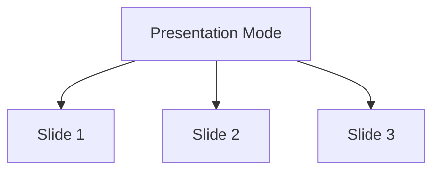

# Presentation Mode Test

This is the first slide of a presentation.

---

## Slide 2: Features

This document tests **presentation mode detection**.

Key features:
- Slide-based navigation
- Drawing tools
- Laser pointer

---

## Slide 3: Code Example

```javascript
function presentationMode() {
  console.log("This is slide 3");
  return "Presentation mode active!";
}
```

---

## Slide 4: Mermaid in Slides



---

## Slide 5: Final Slide

### Expected Behavior:

- ✅ "Presentation Mode" button appears
- ✅ Content displays as normal scrollable page initially
- ✅ When button clicked, enters full-screen presentation
- ✅ Navigation with arrows/clicks
- ✅ Can draw on slides
- ✅ Can use laser pointer

---

**Note:** This document has 6 slides separated by `---` horizontal rules, so it should **DETECT PRESENTATION MODE**.
