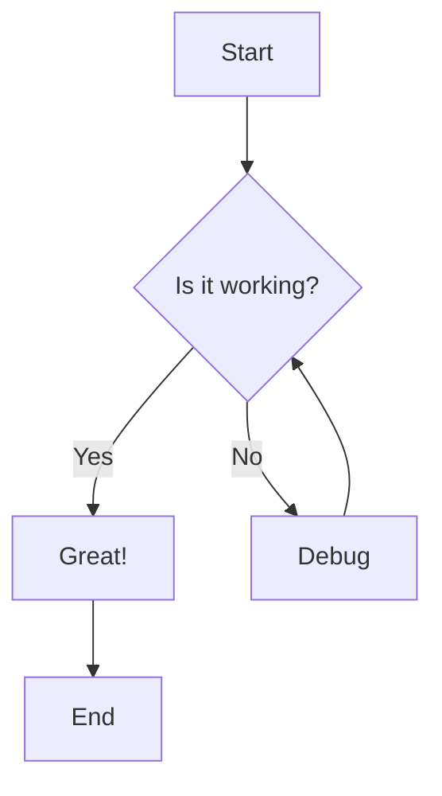
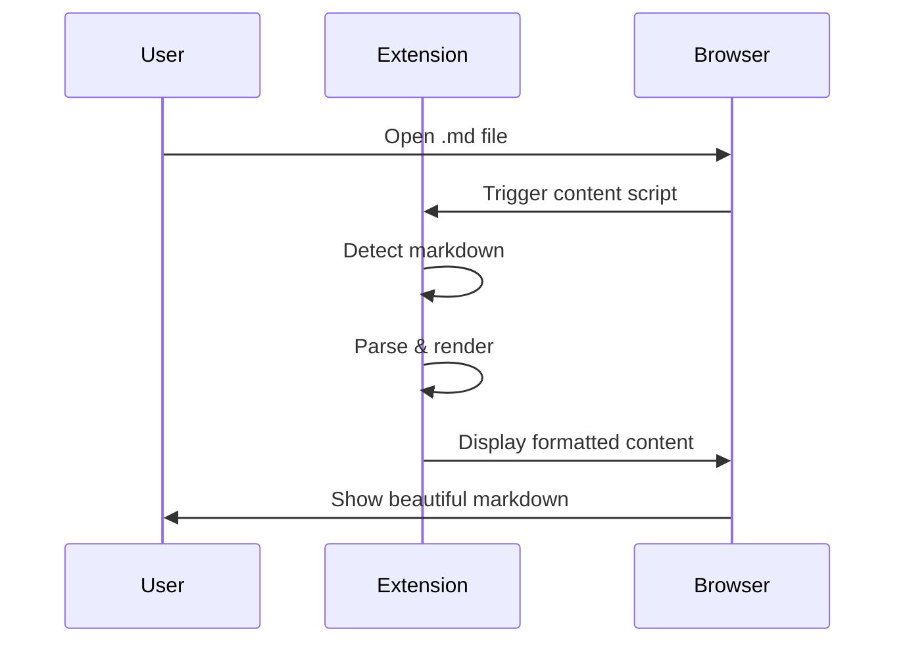
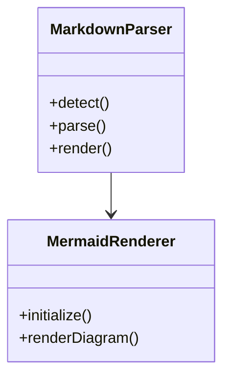

# Sample Markdown Document

This is a test markdown file for the **Markdown Parser** browser extension.

## Features Showcase

### Text Formatting

- **Bold text** using double asterisks
- *Italic text* using single asterisks
- ~~Strikethrough~~ using double tildes
- `Inline code` using backticks

### Lists

#### Unordered List
- Item 1
- Item 2
  - Nested item 2.1
  - Nested item 2.2
- Item 3

#### Ordered List
1. First item
2. Second item
3. Third item

### Code Block

```javascript
function helloWorld() {
  console.log("Hello, World!");
  return true;
}
```

### Blockquote

> This is a blockquote.
> It can span multiple lines.

### Table

| Header 1 | Header 2 | Header 3 |
|----------|----------|----------|
| Cell 1   | Cell 2   | Cell 3   |
| Cell 4   | Cell 5   | Cell 6   |

### Link

[Visit GitHub](https://github.com)

### Image


---

## Mermaid Diagrams

### Flowchart



### Sequence Diagram



### Class Diagram



---

## Task List

- [x] Markdown detection
- [x] Auto rendering
- [x] Mermaid support
- [x] File:// support
- [ ] Theme switching (v1.1)

---

*This document was rendered by the Markdown Parser browser extension.*
